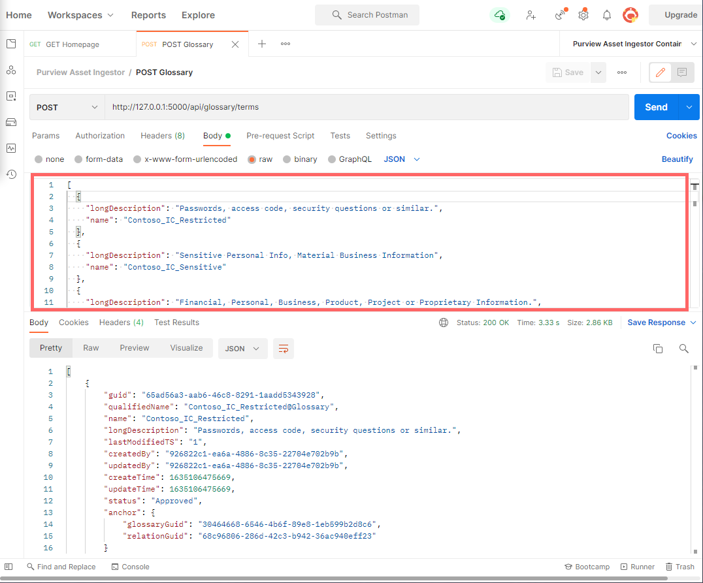
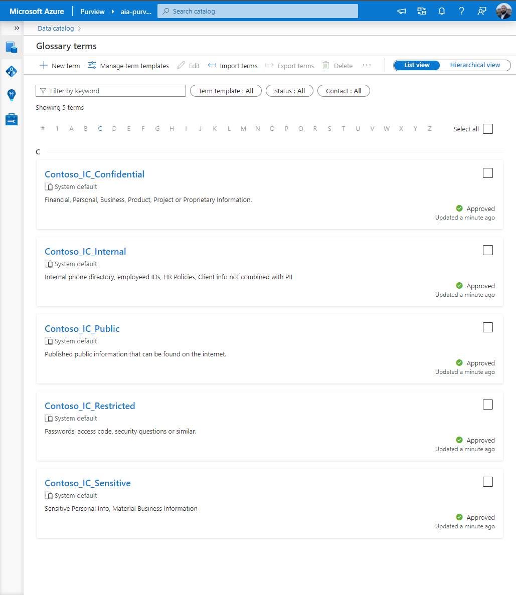
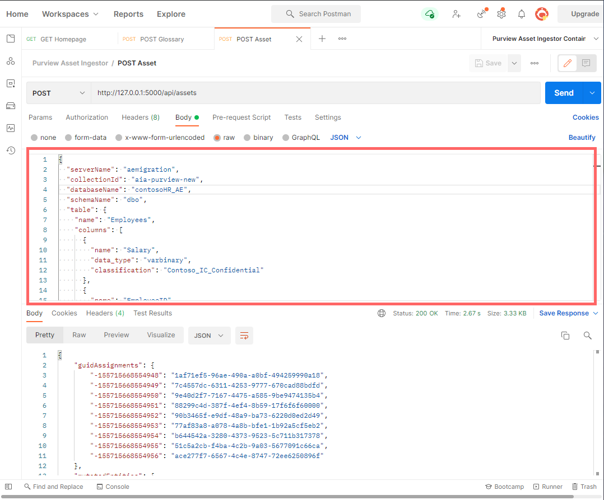
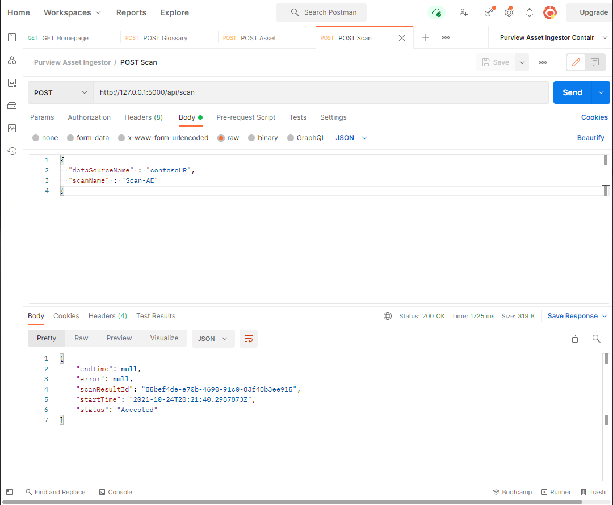
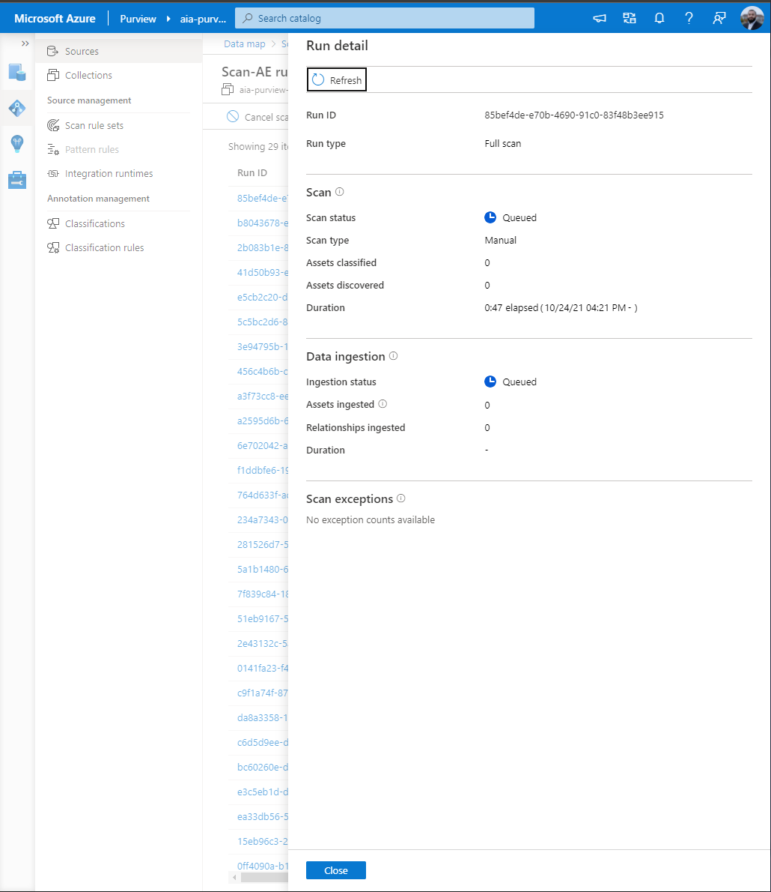
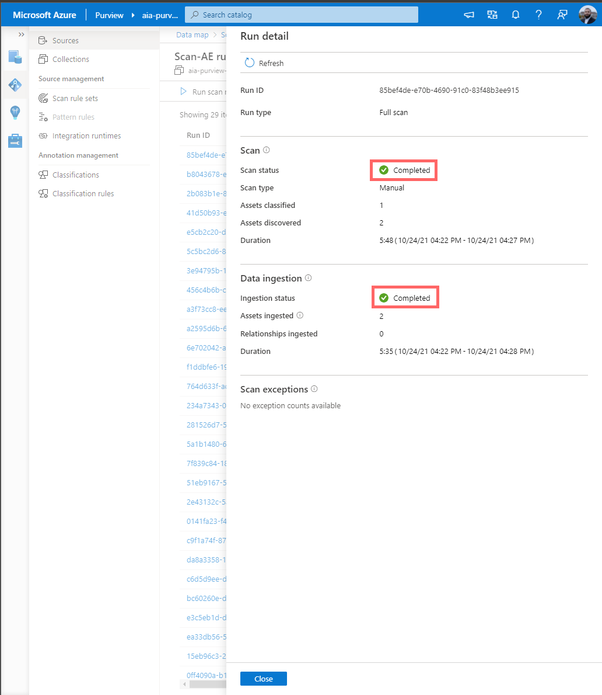
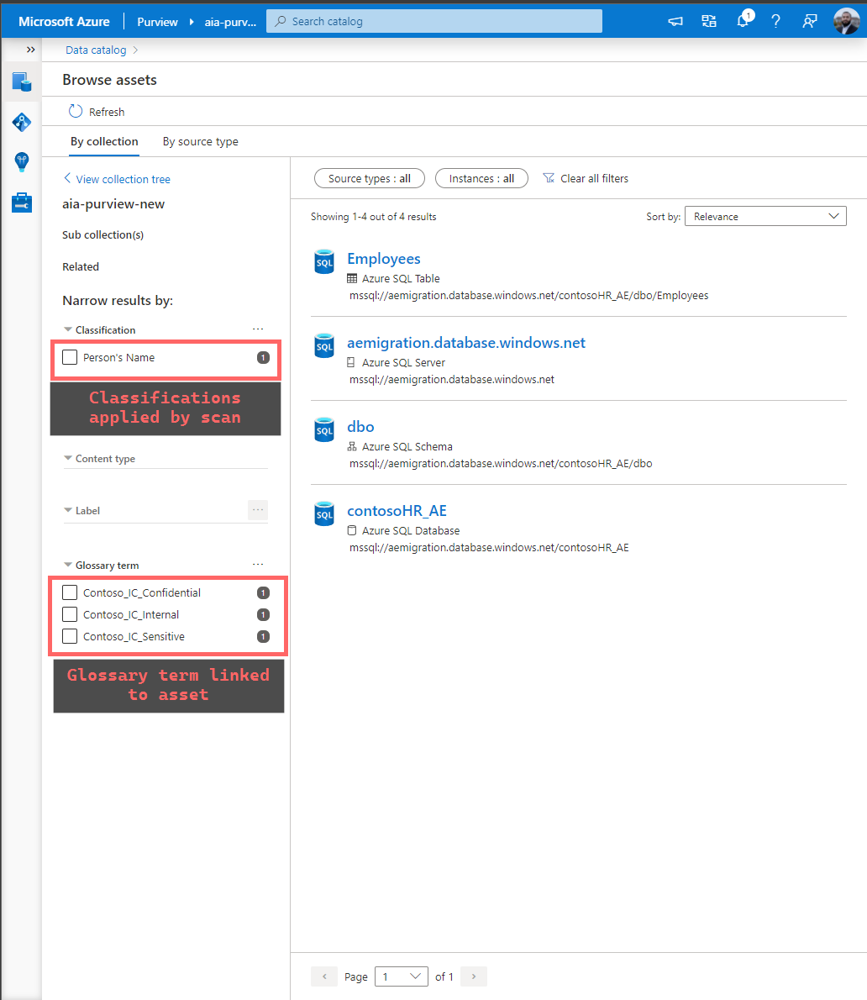
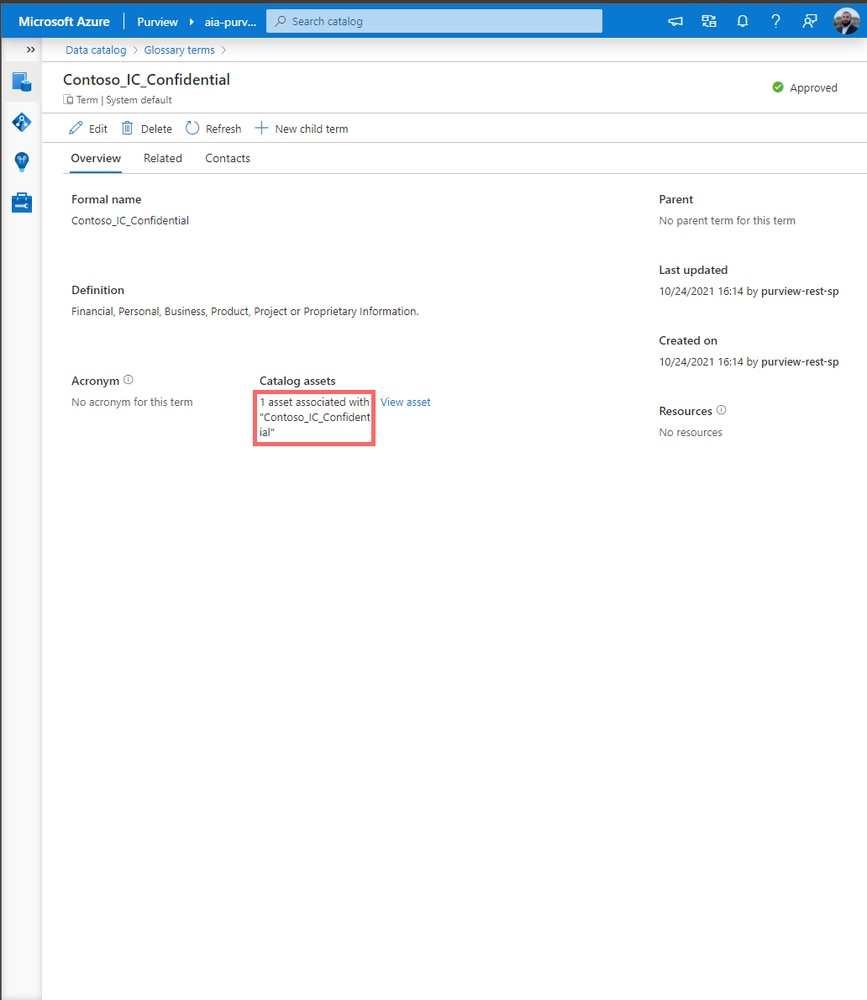
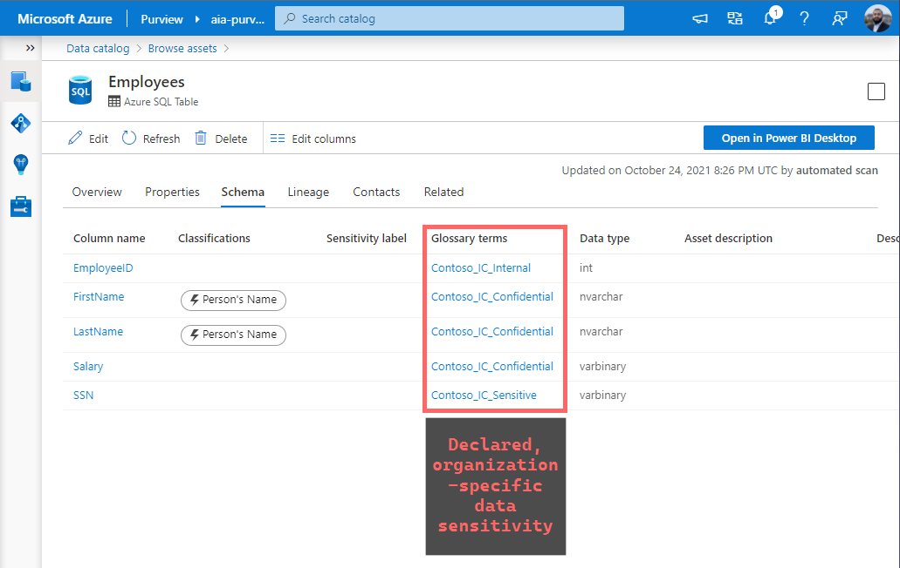

# Azure Purview - Containerized app for declaring custom sensitivity labels to assets as glossary terms <!-- omit in toc -->

A containerized [Python flask app](https://flask.palletsprojects.com/en/2.0.x/) that exposes an API for interacting with Azure Purview to implement Business Logic, using:

- [Purview Python SDK](https://github.com/Azure/azure-sdk-for-python/tree/main/sdk/purview)
- [Purview CLI](https://github.com/tayganr/purviewcli)

## Table of Contents <!-- omit in toc -->

- [Overview](#overview)
- [Pre-reqs](#pre-reqs)
- [Run container on Docker Desktop](#run-container-on-docker-desktop)
- [Demonstration](#demonstration)
  - [Step 1: Create a list of glossary terms to track Custom/organization specific Classification Labels(using a minified JSON)](#step-1-create-a-list-of-glossary-terms-to-track-customorganization-specific-classification-labelsusing-a-minified-json)
  - [Step 2: Create an entire asset chain for an Azure SQL Database, and apply glossary terms to serve as Custom Data Classifications (using a minified JSON)](#step-2-create-an-entire-asset-chain-for-an-azure-sql-database-and-apply-glossary-terms-to-serve-as-custom-data-classifications-using-a-minified-json)
  - [Step 3: Trigger Scan to establish end-to-end asset relationships and have Purview apply Classifications](#step-3-trigger-scan-to-establish-end-to-end-asset-relationships-and-have-purview-apply-classifications)
  - [Step 4: Observe Assets with Custom Sensitivity labels (i.e. glossary terms) applied per column](#step-4-observe-assets-with-custom-sensitivity-labels-ie-glossary-terms-applied-per-column)
- [Additional Resources](#additional-resources)

## Overview

Currently, the three top-level functionalities implemented:

1. **Create a list of glossary terms to track Custom/organization specific Sensitivity Labels** (using a minified JSON)

   > 💡 Today, [Purview only offers Automatic Labelling](https://docs.microsoft.com/en-us/azure/purview/sensitivity-labels-frequently-asked-questions#can-i-manually-label-an-asset--or-manually-modify-or-remove-a-label-in-azure-purview) via Microsoft 365 Sensitivity Labels - this method using Glossary Terms offers a workaround for organizations not leveraging M365 labels, and allows us to programmatically query Purview's REST API to interrogate the asset for declared state (as declared by Data Teams).

2. **Create an entire asset chain for an Azure SQL Database, and apply glossary terms to serve as Custom Data Classifications** (using a minified JSON)

   > 💡 The core value add here is that the Asset Columns will have the declared state available at time of provisioning, which allows us to monitor for classification drift using the methods demonstrated [here](https://www.rakirahman.me/purview-sql-cle-events-with-kafdrop/). This is not possible without having the Asset present with the Custom labels within Purview _before_ the first scan runs, i.e. without this capability, we are not able to track the initial state.

3. **Trigger Scan to establish end-to-end asset relationships and have Purview apply Classifications**

## Pre-reqs

- [Azure SQL DB Data Source](https://docs.microsoft.com/en-us/azure/purview/register-scan-azure-sql-database#register-an-azure-sql-database-data-source) has been registered with Purview (one-time activity)
- A [Scan](https://docs.microsoft.com/en-us/azure/purview/register-scan-azure-sql-database#creating-and-running-a-scan) has been created on the Data Source, but not run (one-time activity):

  

Note that this could have been done using an [API call](https://github.com/tayganr/purviewcli#scan) as well if required.

- We start with no Assets in this particular demo, but other assets can exist (assuming no conflict):
  

- We start with no Glossary Terms in this particular demo, but other Terms can exist (assuming no conflict):
  

## Run container on Docker Desktop

Clone this repo - then to run the container locally on Docker Desktop, run:

```powershell
# Build container from Dockerfile
docker build -t purview-asset-ingestor .

# Start container by injecting environment variables
docker run `
  -e "PURVIEW_NAME=<your--purview--account>" `
  -e "AZURE_CLIENT_ID=<your--client--id>" `
  -e "AZURE_CLIENT_SECRET=<your--client--secret>" `
  -e "AZURE_TENANT_ID=<your--azure--tenant--id>" `
  -p 5000:5000 `
  --rm -it purview-asset-ingestor

```


And the container can be called via Postman at `http://127.0.0.1:5000` as a `GET` request:


## Demonstration

### Step 1: Create a list of glossary terms to track Custom/organization specific Classification Labels(using a minified JSON)

The following minified JSON payload represents our Organization's Custom Classification Labels:

```JSON
[
  {
    "longDescription": "Passwords, access code, security questions or similar.",
    "name": "Contoso_IC_Restricted"
  },
  {
    "longDescription": "Sensitive Personal Info, Material Business Information",
    "name": "Contoso_IC_Sensitive"
  },
  {
    "longDescription": "Financial, Personal, Business, Product, Project or Proprietary Information.",
    "name": "Contoso_IC_Confidential"
  },
  {
    "longDescription": "Internal phone directory, employeed IDs, HR Policies, Client info not combined with PII",
    "name": "Contoso_IC_Internal"
  },
  {
    "longDescription": "Published public information that can be found on the internet.",
    "name": "Contoso_IC_Public"
  }
]
```

We perform a `POST` request to `http://127.0.0.1:5000/api/glossary/terms` using Postman with the above JSON in the `Body`:


And we see the Glossary Terms get created within Purview:


### Step 2: Create an entire asset chain for an Azure SQL Database, and apply glossary terms to serve as Custom Data Classifications (using a minified JSON)

The following minified JSON payload represents Azure SQL Database we are looking to onboard - containing the Application Specific Data Schema and declared classifications:

```JSON
{
  "serverName": "aemigration",
  "collectionId": "aia-purview-new",
  "databaseName": "contosoHR_AE",
  "schemaName": "dbo",
  "table": {
    "name": "Employees",
    "columns": [
      {
        "name": "Salary",
        "data_type": "varbinary",
        "classification": "Contoso_IC_Confidential"
      },
      {
        "name": "EmployeeID",
        "data_type": "int",
        "classification": "Contoso_IC_Internal"
      },
      {
        "name": "LastName",
        "data_type": "nvarchar",
        "classification": "Contoso_IC_Confidential"
      },
      {
        "name": "FirstName",
        "data_type": "nvarchar",
        "classification": "Contoso_IC_Confidential"
      },
      {
        "name": "SSN",
        "data_type": "varbinary",
        "classification": "Contoso_IC_Sensitive"
      }
    ]
  }
}
```

We perform a `POST` request to `http://127.0.0.1:5000/api/assets` using Postman with the above JSON in the `Body`:


And we see the Assets get created within Purview (including the Columns and classifications):


### Step 3: Trigger Scan to establish end-to-end asset relationships and have Purview apply Classifications

The following JSON payload asks Purview to run a scan against the Data Source we already established in pre-reqs:

```JSON
{
  "dataSourceName" : "contosoHR",
  "scanName" : "Scan-AE"
}
```

We perform a `POST` request to `http://127.0.0.1:5000/api/scan` using Postman with the above JSON in the `Body`:


And we see the scan begins on the asset:


### Step 4: Observe Assets with Custom Sensitivity labels (i.e. glossary terms) applied per column

Once the Scan is **Completed**:


We see the Assets have the Glossary Terms applied on search facet, and the Term layer:



And the Asset is labelled at the column level:


As desired.

## Additional Resources

- [Detecting SQL Column Decryption using Purview, Kafka, Kafdrop and Spark](https://www.rakirahman.me/purview-sql-cle-events-with-kafdrop/)
