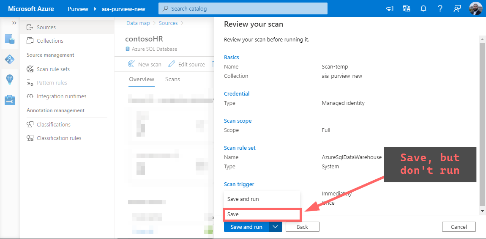
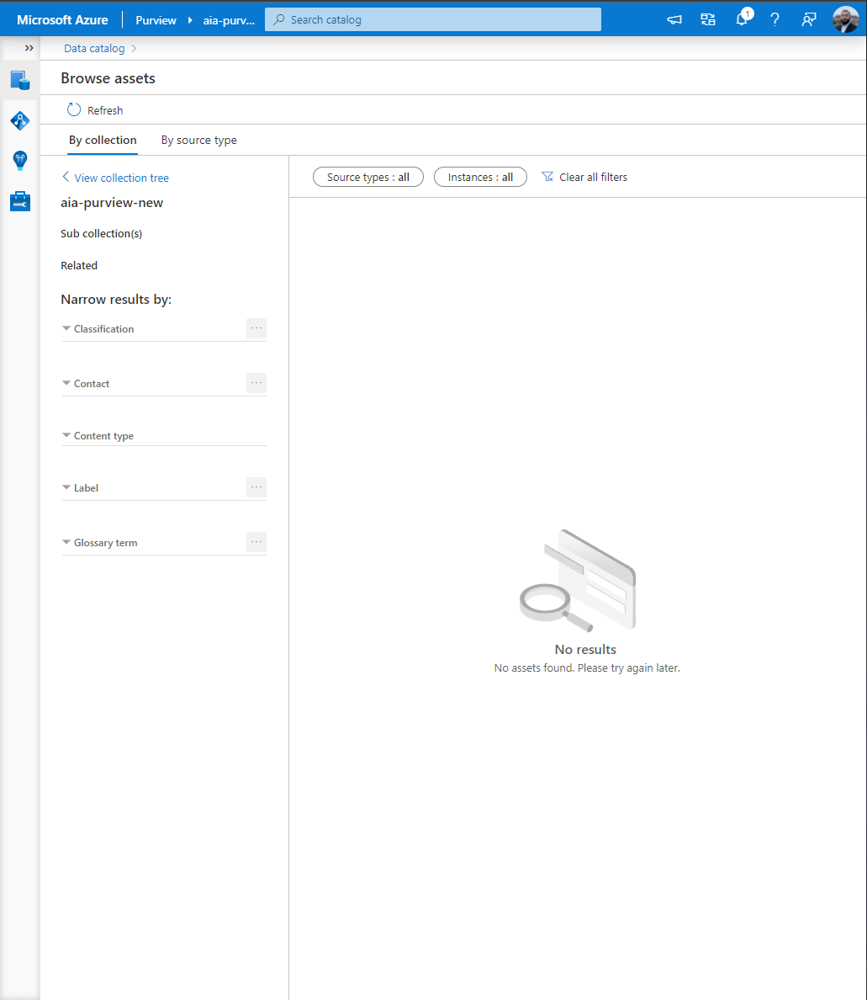
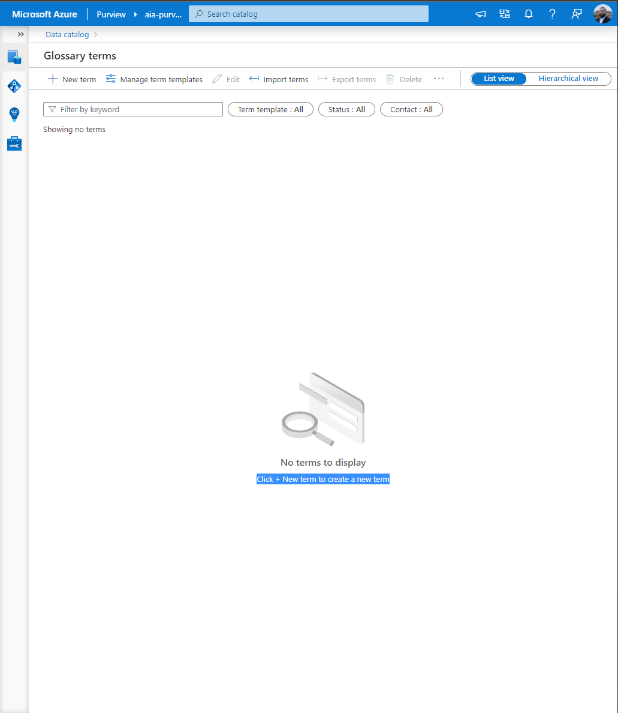
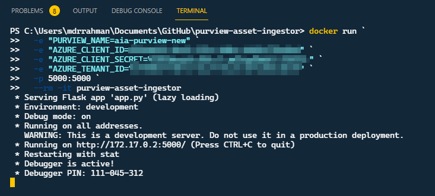
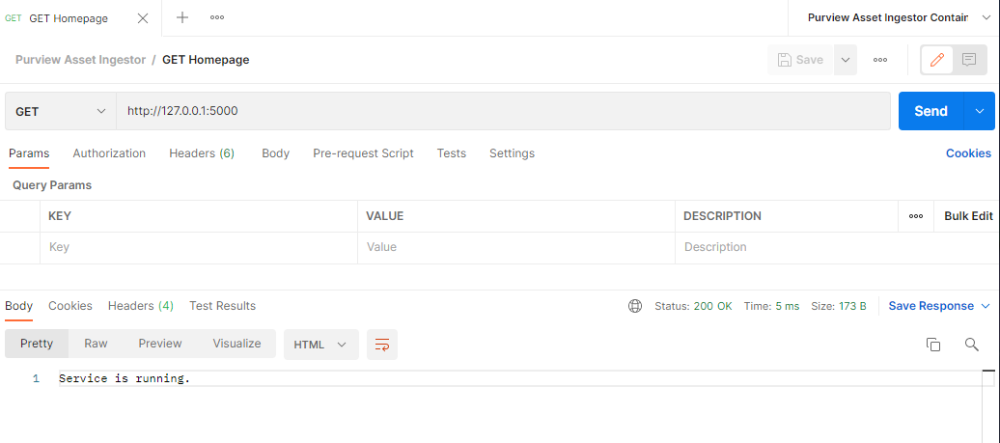

# Azure Purview - Containerized app for declaring custom classification labels to assets

A containerized [Python flask app](https://flask.palletsprojects.com/en/2.0.x/) that exposes an API for interacting with Azure Purview to implement Business Logic, using:

- [Purview Python SDK](https://github.com/Azure/azure-sdk-for-python/tree/main/sdk/purview)
- [Purview CLI](https://github.com/tayganr/purviewcli)

#### Overview

Currently, the three top-level functionalities implemented:

1. **Create a list of glossary terms to track Custom/organization specific Classification Labels** (using a minified JSON)

   > 💡 Today, [Purview only offers Automatic Labelling](https://docs.microsoft.com/en-us/azure/purview/sensitivity-labels-frequently-asked-questions#can-i-manually-label-an-asset--or-manually-modify-or-remove-a-label-in-azure-purview) via Microsoft 365 Sensitivity Labels - this offers a workaround for organizations not leveraging M365 labels.

2. **Create an entire asset chain for an Azure SQL Database, and apply glossary terms to serve as Custom Data Classifications** (using a minified JSON)

   > 💡 The core value add here is that the Asset Columns will have the declared state available at time of provisioning, which allows us to monitor for classification drift using the methods demonstrated [here](https://www.rakirahman.me/purview-sql-cle-events-with-kafdrop/). This is not possible without having the Asset present with the Custom labels within Purview _before_ the first scan runs, i.e. without this capability, we are not able to track the initial state.

3. **Trigger Scan to establish end-to-end asset relationships and have Purview apply Classifications**

#### Pre-reqs

<details>
  <summary>Pre-requisite setup</summary>
- [Azure SQL DB Data Source](https://docs.microsoft.com/en-us/azure/purview/register-scan-azure-sql-database#register-an-azure-sql-database-data-source) has been registered with Purview (one-time activity)
- A [Scan](https://docs.microsoft.com/en-us/azure/purview/register-scan-azure-sql-database#creating-and-running-a-scan) has been created on the Data Source, but not run (one-time activity):



Note that this could have been done using an [API call](https://github.com/tayganr/purviewcli#scan) as well if required.

- We start with no Assets in this particular demo, but other assets can exist (assuming no conflict):
  

- We start with no Glossary Terms in this particular demo, but other Terms can exist (assuming no conflict):

</details>

#### Run container on Docker Desktop

Clone this repo - then to run the container locally on Docker Desktop, run:

```powershell
# Build container from Dockerfile
docker build -t purview-asset-ingestor .

# Start container by injecting environment variables
docker run `
  -e "PURVIEW_NAME=<your--purview--account>" `
  -e "AZURE_CLIENT_ID=<your--client--id>" `
  -e "AZURE_CLIENT_SECRET=<your--client--secret>" `
  -e "AZURE_TENANT_ID=<your--azure--tenant--id>" `
  -p 5000:5000 `
  --rm -it purview-asset-ingestor

```



And the container can be called via Postman at `http://127.0.0.1:5000` as a `GET` request:



#### Demonstration
